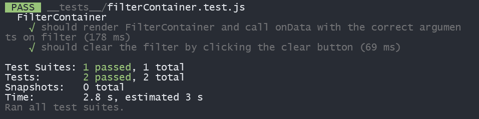
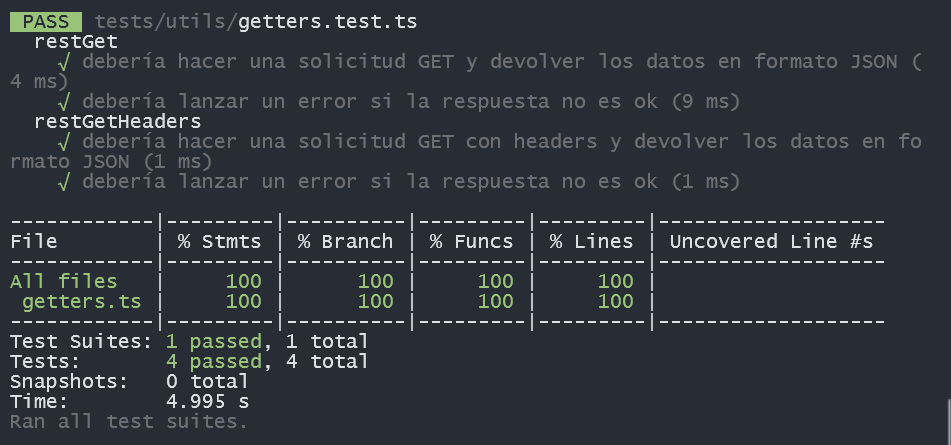

# Streaming-team2-docs
repositorio de información general
# Repositorios del Proyecto Streamings Team 2

Este conjunto de repositorios contiene los microfrontends y las utilidades que componen el proyecto **Streamings Team 2**. A continuación, encontrarás una breve descripción de cada repositorio y cómo clonarlos y configurarlos para su uso.

## Descripción de los Repositorios

### 1. **mfe-st-host**
   - **Descripción**: Este repositorio contiene el host principal para los microfrontends. Es responsable de gestionar la carga y la integración de otros microfrontends.
   - **Tecnologías**: JavaScript, React ,tailwind,mf(modulos federados)

### 2. **mfe-st-common**
   - **Descripción**: Repositorio que contiene módulos y componentes comunes compartidos entre diferentes microfrontends. Proporciona utilidades generales como servicios y configuraciones compartidas.
  - **Tecnologías**: JavaScript, React ,tailwind,mf(modulos federados)

### 3. **mfe-st-error**
   - **Descripción**: Este repositorio maneja los componentes relacionados con el manejo de errores y la visualización de mensajes de error dentro del sistema.
    - **Tecnologías**: JavaScript, React ,tailwind,mf(modulos federados)


### 4. **mfe-st-utils**
   - **Descripción**: Repositorio con funciones y herramientas reutilizables, como validaciones, formateadores y utilidades generales que pueden ser utilizadas en varios microfrontends.
   - **Tecnologías**: JavaScript, React ,tailwind,mf(modulos federados)


## Cómo Clonar y Usar los Repositorios

Puedes clonar todos los repositorios de forma automática y asegurarte de tener las últimas actualizaciones con el siguiente script en tu terminal. Este script realiza los siguientes pasos:

1. Clona los repositorios si no están ya presentes.
2. Si el repositorio ya existe, se asegura de actualizarlo y cambiar a la rama `develop`.
3. Instala las dependencias de cada repositorio utilizando `npm install`.

### Script para Clonar y Usar los Repositorios

```bash
repos=(
 "https://github.com/Streamings-Team2/mfe-st-host"
 "https://github.com/Streamings-Team2/mfe-st-common"
 "https://github.com/Streamings-Team2/mfe-st-error"
 "https://github.com/Streamings-Team2/mfe-st-utils"
 "https://github.com/Streamings-Team2/mfe-st-login-v2"
 "https://github.com/Streamings-Team2/mse-graphql"
)

for repo_url in "${repos[@]}"
do
  repo_name=$(basename "$repo_url" .git)

  if [ ! -d "$repo_name" ]; then
    printf "\e[36m<---------------------------- Clonando $repo_name ---------------------------->\e[0m\n"
    git clone "$repo_url"
    
    cd "$repo_name" || exit
    
    printf "\e[36m<---------------------------- Cambiando a la rama develop ---------------------------->\e[0m\n"
    git checkout develop 
    
    printf "\e[36m<---------------------------- Instalando dependencias ---------------------------->\e[0m\n"
    npm install
    
    cd ..
  else
    cd "$repo_name" || exit
    printf "\e[36m<---------------------------- Actualizando $repo_name ---------------------------->\e[0m\n"
    git checkout develop 
    git pull
    
    printf "\e[36m<---------------------------- Instalando dependencias ---------------------------->\e[0m\n"
    npm install

    cd ..
  fi
done
```

### Comando para ejecutar los repositorios
```bash
cd mfe-st-<repositorio>
npm start
```

## Test

Actualmente los repositorios que cuentan con test implementados son mfe-st-host y mfe-st-utils

### Test para el repositorio host


### Test para el repositorio utils

