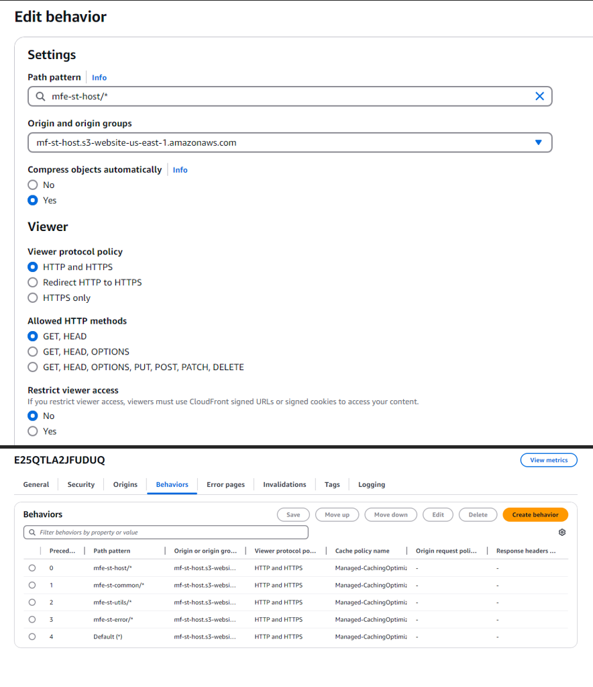

## Pasos para llevar a cabo el despliegue

1. **Creación del Build en los Microfrontend**

   a. Creación del documento .env basándose en el archivo .env.example de
   cada microfrontend y llenar el las variables que se indica

   

   b. Ejecutando el siguiente comando se genera en el proyecto la carpeta dist.

   asegurate de ingresar al path de cada microfrontend

   ```bash title="micro/<micro-nombe>"
   npm run build

   ```

   c. Una vez obtenidos los archivos dentro de la carpeta dist del build, es necesario cargarlos en el bucket.

   

2. **Proceso de despliegue**

   a. En la consola de AWS se realiza la búsqueda del servicio de S

   

   b. Una vez ingresado a S3 se procese a crear un bucket

   

   c. Se mostrará un formulario en el cual se asigna un nombre único al bucket y se desactiva el bloqueo de acceso publico

   

   d. Realizada la configuración del bucket se debe ingresar al bucket y crear las carpetas donde se alojarán los compilados de cada MFE, adicional en la opción de permisos se agrega una política para que permita la lectura pública de los objetos

   

   e. Una vez creada la estructura de las carpetas, se procede a cargar los archivos generados en la carpeta dist de cada mfe tras el proceso de build. Se puede arrastrar y soltar los archivos.

   

   f. Después de cargados todos los mfe, se procede a realizar la conexión con cloufront para poder acceder de manera segura al aplicativo.

3. **Creación Cloudfront**

   a. En la consola de AEse realiza la búsqueda del servicio de cloudfront

   

   b. Una vez ingresado se procede a crear una nueva distribución

   

   c. Se mostrará un formulario aquí se debe seleccionar el origen que en este caso seria el bucket que se creo en el paso 1 las demás opciones de pueden dejar como están por defecto.

   

   d. Una vez creada la distribución, se procede a crear los comportamientos que tendrá según su url importante tener presente cual es el domain name

   

   e. En la opción de behaviors se crearán los comportamientos que tendrá según sea la solicitud del contenido

   

   f. Al crear el comportamiento, se mostrara un formulario en el que se pedirá un path en este caso será el de la carpeta que se creó en el bucket y el origen que es el bucket creado

   

   g. Con esto ya quedaría configurada la conexión con el S3 para poder acceder al distibution domain

   
