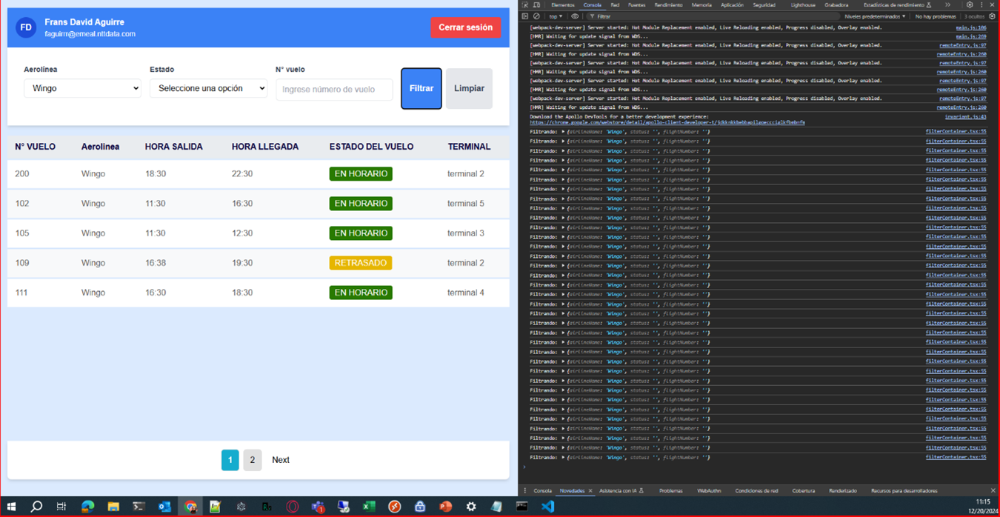

# Comparación con fetch

Para este proceso se mantuvo el comportamiento haciendo uso de fetch y un log
con el cual validar la cantidad de veces que se realiza la consulta al API. Esta
consulta contiene los mismos parámetros y se hace reiterativamente a razón del
botón de consulta. Después se repitió el mismo proceso pero con la
implementación de GraphQL.

## Consultas al API con Fetch

1. Herramienta de desarrollador en pestaña de red viendo la misma consulta hecha reiteradas veces.
   
2. Herramienta de desarrollador en pestaña de consola viendo los mismos parámetros hechos reiteradas veces.
   

## Consultas al API con GraphQL

1. Herramienta de desarrollador en pestaña de red viendo la misma consulta hecha reiteradas veces.
   
2. Herramienta de desarrollador en pestaña de consola viendo los mismos parámetros hechos reiteradas veces.
   

Se puede apreciar como gracias al manejo de cache hecho por GraphQL por mas
veces que se realice la consulta al API esta conserva la respuesta debido a que es
la misma consulta en un corto periodo de tiempo, evitando así llamados
reiterativos presentes en el caso de uso de Fetch.
