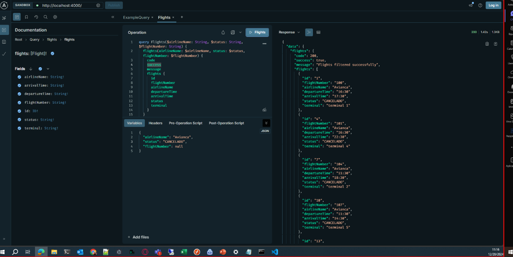
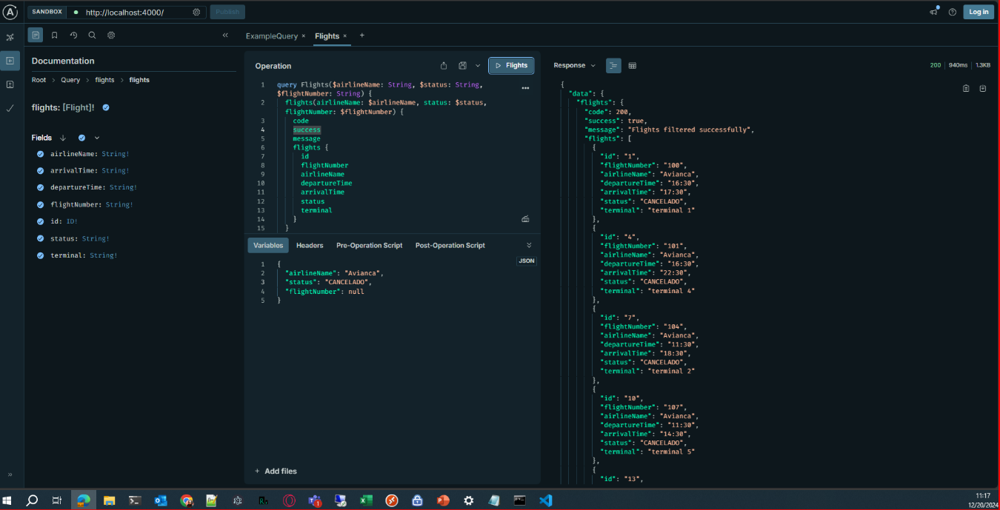
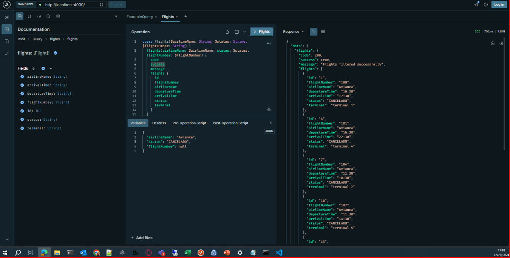

# Reducción de tiempo en las consultas

Para este proceso se hizo uso de la herramienta Apollo, suite con la cual es posible realizar las consultas por medio de GraphQL, obtener sus respuestas y ver información clave. Se realiza la misma consulta reiterativamente consiguiendo apreciar la reducción en tiempos de la consulta.

## Consultas reiterativas al API con GraphQL en Apollo

1. Respuesta en 1.42 segundos.  
   
1. Respuesta en 1.35 segundos.  
   
1. Respuesta en 940 milisegundos.
   
1. Respuesta en 844 milisegundos.
   
1. Respuesta en 702 milisegundos.
   
