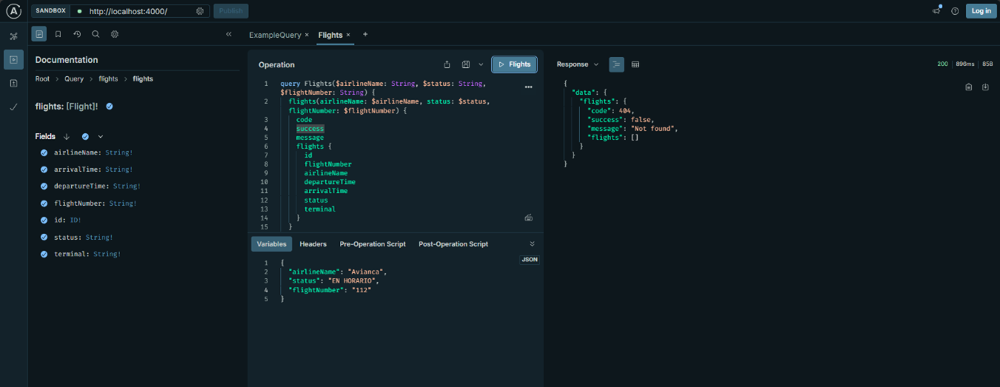
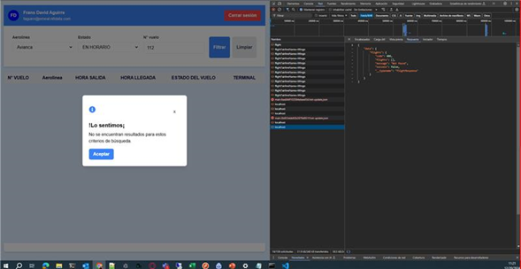

# Manejo de errores

Tras la implementación de un manejo de errores en el esquema del servidor de GraphQL, se realizaron consultas al API las cuales no encontrarían el registro correspondiente, consiguiendo manejar la respuesta como success en la red pero con la información correspondiente del error en la misma. Finalmente, manejar el error desde el Frontend gracias a la información recibida.

## Consultas de registro no existente al API con GraphQL

1. Respuesta de success con la información del error.
   
2. Manejo del error desde Frontend.
   
