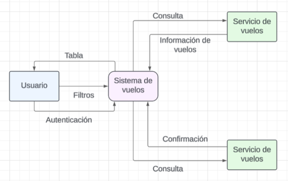
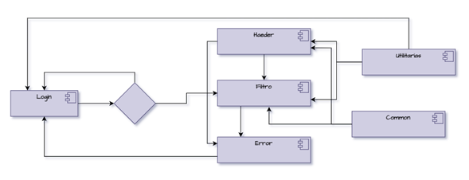
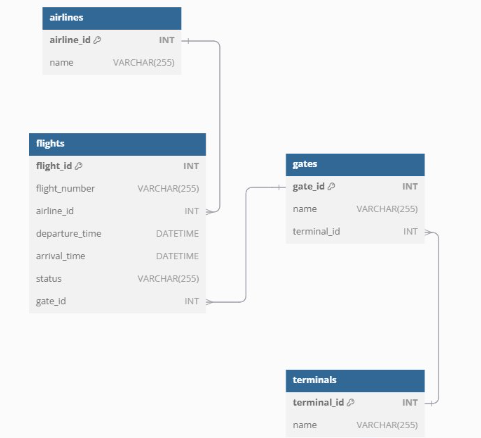
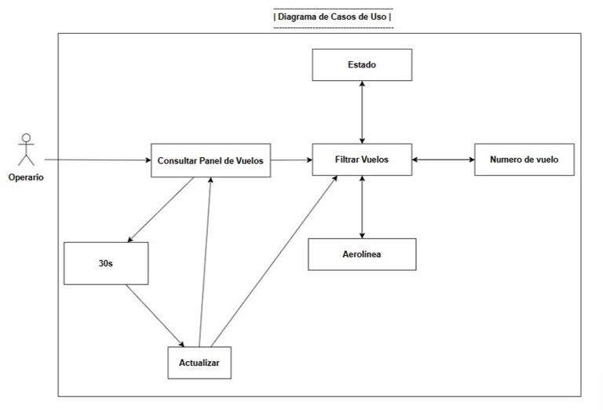
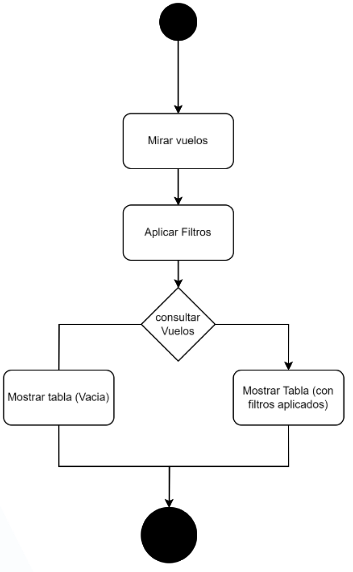
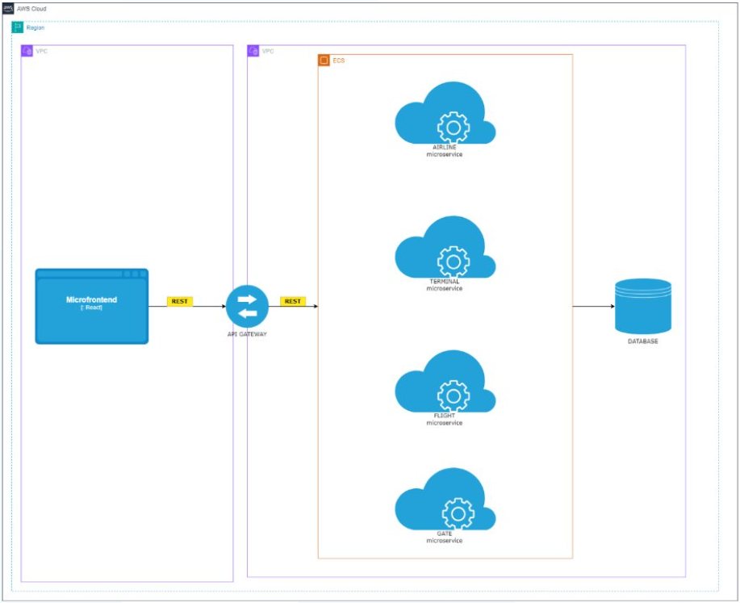
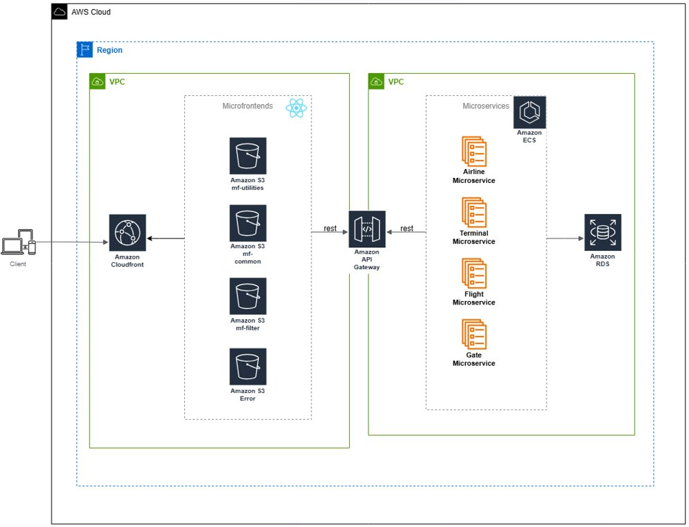

# Diagramas de arquitectura

### Diagrama de Contexto 

### Diagrama de Componentes 

### Diagrama de Base de datos

### Diagrama de Casos de uso

- El operador puede consultar la información en el panel de vuelos, que se actualiza cada 30 segundos, lo que le permite disponer de datos en tiempo real para tomar decisiones informadas y rápidas. Asimismo, el operador tiene la posibilidad de aplicar filtros según sus necesidades, ya sea por estado de vuelo, número de vuelo o aerolínea, o bien combinar varios filtros simultáneamente para localizar información específica de manera más eficiente.

### Diagrama de Actividad

### Diagrama Backend

### Diagrama de la nube

- Sistema implementado en una zona para alta disponibilidad.​

- VPCs:​

  - Pública: Accesible desde internet para Amazon S3.​

  - Privada: Exclusiva para los microservicios.​

- CloudFront: Acelera la entrega de contenido con cache y protege el acceso directo a los buckets de S3.​

- Amazon S3: Cada MFE se despliega en un bucket individual, configurado para hosting estático con permisos públicos.​

- API Gateway: Expone las rutas necesarias y conecta a los microservicios.​

- Microservicios: Desplegados en un clúster de ECS, con capacidad de escalado automático para cada microservicio.​

- RDS: Implementada en una subred privada y accesible solo por microservicios en la misma VPC para mayor seguridad.

