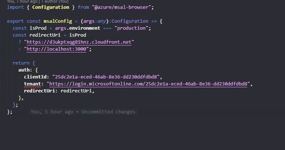

Para realizar cambios en la configuración de msal solo se debe modificar el archivo msalConfig.ts el cual se encuentra en el repositorio mfe-st-host, dentro de este archivo se encuentra el clientId, Tenant y la url de redirección que cambia según el ambiente en el que se encuentre.

