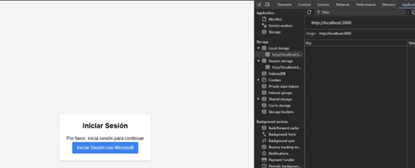
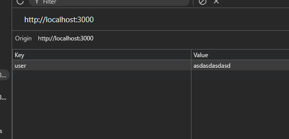

Validar que el sistema maneja correctamente posibles casos de alteración del usuario guardado en localStorage

### Pasos

1. Iniciar sesión con credenciales válidas.
2. Eliminar la llave de user en localStorage.
3. Modificar el valor de la llave de user en localStorage

### Resultado esperado

Redirecciona a la página de logueo si detecta alteraciones del usuario.

### Ejecución

Se inicia sesión con credenciales válidas y se procede a eliminar la llave de usuario en localStorage al recargar se redirecciona a la pagina de logueo de igual manera si el valor de la llave de usuario es un dato invalido, no se evidencian errores de funcionamiento del sitio.

