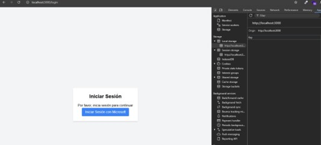
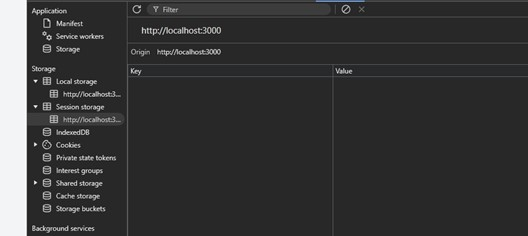

Validar que el usuario puede cerrar sesión correctamente

### Pasos

1. Inicia sesión y luego realiza una acción de cierre de sesión.
2. Verificar que el token se elimina del almacenamiento.
3. Comprobar que se indique al usuario el cierre de sesión.

### Resultado esperado

Los tokens se eliminan y el usuario no tiene acceso a recursos protegidos.

### Ejecución

Se realiza el proceso de cierre de sesión, se muestra mensaje de cierre de sesión,se evidencia que se elimina todos los tokens de localStorage y sessionStorage además se comprueba que siempre será redireccionado a la vista de logueo.

