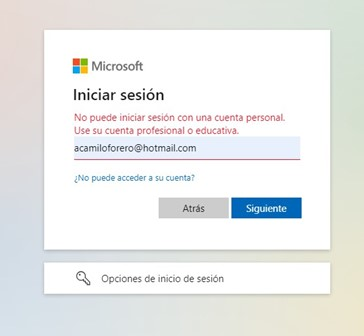

Validar que el sistema maneja correctamente las credenciales incorrectas

### Pasos

1. Iniciar sesión con credenciales no válidas.
2. Observar si aparece un mensaje de error claro.

### Resultado esperado

El inicio de sesión falla con un mensaje de error legible.

### Ejecución

Para esta prueba se trata de iniciar sesión con un usuario fuera de la organización y se evidencia ventana de alerta que notifica que el usuario no es valido.

