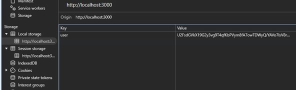
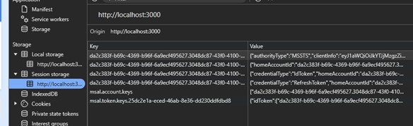

Validar que un usuario con credenciales correctas puede iniciar sesión

### Pasos

1. Iniciar sesión con credenciales válidas.
2. Verificar que se redirige al usuario a la página de inicio o al recurso protegido.
3. comprobar que el token (ID token, access token) se almacena correctamente (localStorage, sessionStorage, etc).

### Resultado esperado

El usuario accede al sistema y el token está disponible para futuras solicitudes.

### Ejecución

Realizado el proceso de autenticación se evidencia correcto inicio de sesión y redireccionamiento, además de guardado del usuario en localStorage encriptado, así como de los diferentes tokens en sessionStorage.

