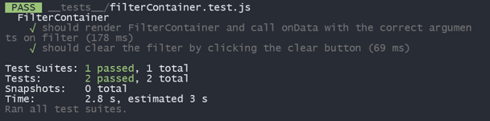
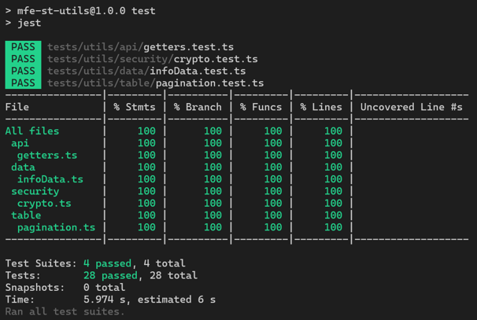
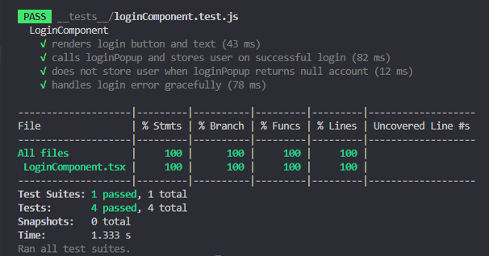

# Microfrontends con test del Proyecto Streamings Team 2

Este conjunto de Microfrontends contiene los microfrontends que poseen lógica y por ende las pruebas unitarias correspondientes para asegurar su funcionamiento. A continuación, encontrarás una breve descripción de cada Microfrontend.

## Descripción de los Microfrontends

### 1. **mfe-st-host**

- **Descripción**: Este Microfrontend contiene el host principal para los microfrontends. Es responsable de gestionar la carga y la integración de otros microfrontends.
- **Tecnologías**: Resultado de los test:
  

### 2. **mfe-st-utils**

- **Descripción**: Repositorio con funciones y herramientas reutilizables, como validaciones, formateadores y utilidades generales que pueden ser utilizadas en varios microfrontends.
- **Tecnologías**: Resultado de los test:
  

### 3. **mfe-st-login**

- **Descripción**: Este Microfrontend maneja los componentes relacionados con el inicio de sesión, encriptación de seguridad y el redireccionamiento en caso de ingreso existoso.
- **Tecnologías**: Resultado de los test:
  
